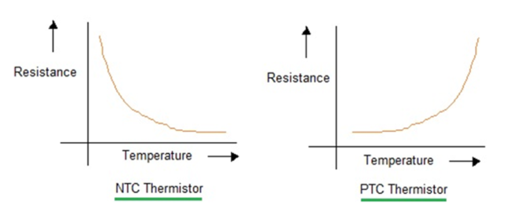

03/10/2025

# Thermistor

Thermistors are temperature sensitive resistors.
There are two categories;
1. NTC (negative temperature coefficient)
    - Resistance decreases with heat
    - Used in ovens, AC units, fire detectors
    - This are split further into;
    a. Ceramic bead
        - Stable
        - Fast to respond to temperature changes
    b. Disk and Chip
        - Slower response time
        - Better current handling capacity. (used for in-rush current limiting)
    c. Glass encapsulated
        - Used where the temperature could exceed 150 degrees C.
        - They also have more protection from the environment
2. PTC (positive temperature coefficient)
    - Resistance increases with heat
    - Used in motors, heaters and thermistats
    - Act in the opposite to NTC. If the incoming current spikes, the temperature increases and so does their resistance. Reducing the current flow.
    - There a two groups of PTC
    a. Silistor - silicon based
        - A gradual rise in resistance as the temperature increases
    b. Switching type
        - They behave like an NTC thermistor until a certain temperture is reached (the Curie point or Curie temperature $T_C$). At which point they behave as an PTC, and the resistance increases rapidly.
        - Curie point - temperature at which substances lose their permanent magnetic properties.
        

    
## NTC
NTCs are suseptible to very small changes in temperature.
They can be used as an in-rush current limiter.
    - e.g. when current rushes into a circuit, the initial high resistance prevents the full current from entering the system.
        - As the resistor heats up, it's internal resistance reduces and more current can flow.
